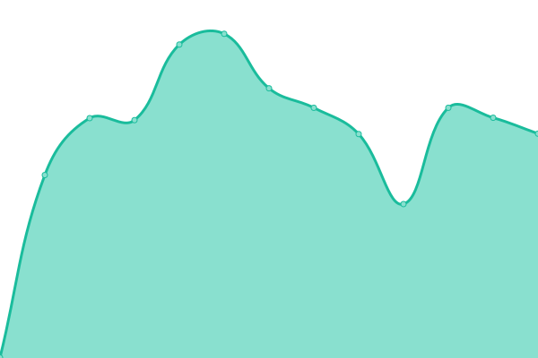

# [📈 Live Status](https://dchtools.github.io/uptimemonitor): <!--live status--> **🟩 All systems operational**

This repository contains the open-source uptime monitor and status page for [Thomas Schilling](https://www.dch.de), powered by [Upptime](https://github.com/upptime/upptime).

With [Upptime](https://upptime.js.org), you can get your own unlimited and free uptime monitor and status page, powered entirely by a GitHub repository. We use [Issues](https://github.com/dchtools/uptimemonitor/issues) as incident reports, [Actions](https://github.com/dchtools/uptimemonitor/actions) as uptime monitors, and [Pages](https://dchtools.github.io/uptimemonitor) for the status page.

<!--start: status pages-->
<!-- This summary is generated by Upptime (https://github.com/upptime/upptime) -->
<!-- Do not edit this manually, your changes will be overwritten -->
<!-- prettier-ignore -->
| URL | Status | History | Response Time | Uptime |
| --- | ------ | ------- | ------------- | ------ |
|  [dch website](https://www.dch.de/home) | 🟩 Up | [dch-website.yml](https://github.com/dchtools/uptimemonitor/commits/HEAD/history/dch-website.yml) | 

 1020ms
     
 | 

<a href="https://dchtools.github.io/uptimemonitor/history/dch-website">100.00%</a>
    

|  [nl-api](https://api.djbobo.ch:433/api2/health) | 🟩 Up | [nl-api.yml](https://github.com/dchtools/uptimemonitor/commits/HEAD/history/nl-api.yml) | 

 1163ms
     
 | 

<a href="https://dchtools.github.io/uptimemonitor/history/nl-api">99.35%</a>
    

|  [djbobo website](https://www.djbobo.ch) | 🟩 Up | [djbobo-website.yml](https://github.com/dchtools/uptimemonitor/commits/HEAD/history/djbobo-website.yml) | 

 1689ms
     
 | 

<a href="https://dchtools.github.io/uptimemonitor/history/djbobo-website">99.35%</a>
    

|  [lima-server](https://lima.dch.de:8080/api/v1) | 🟩 Up | [lima-server.yml](https://github.com/dchtools/uptimemonitor/commits/HEAD/history/lima-server.yml) | 

 577ms
     
 | 

<a href="https://dchtools.github.io/uptimemonitor/history/lima-server">100.00%</a>
    

|  [dchlab](https://lab.dch.de) | 🟩 Up | [dchlab.yml](https://github.com/dchtools/uptimemonitor/commits/HEAD/history/dchlab.yml) | 

 592ms
     
 | 

<a href="https://dchtools.github.io/uptimemonitor/history/dchlab">95.50%</a>
    

|  [pb api](https://dev.dch.de:8083/up.txt) | 🟩 Up | [pb-api.yml](https://github.com/dchtools/uptimemonitor/commits/HEAD/history/pb-api.yml) | 

 634ms
     
 | 

<a href="https://dchtools.github.io/uptimemonitor/history/pb-api">99.36%</a>
    

<!--end: status pages-->

[**Visit our status website →**](https://dchtools.github.io/uptimemonitor)

## 📄 License

- Powered by: [Upptime](https://github.com/upptime/upptime)
- Code: [MIT](./LICENSE) © [Anand Chowdhary](https://anandchowdhary.com), supported by [Pabio](https://pabio.com)
- Data in the `./history` directory: [Open Database License](https://opendatacommons.org/licenses/odbl/1-0/)
